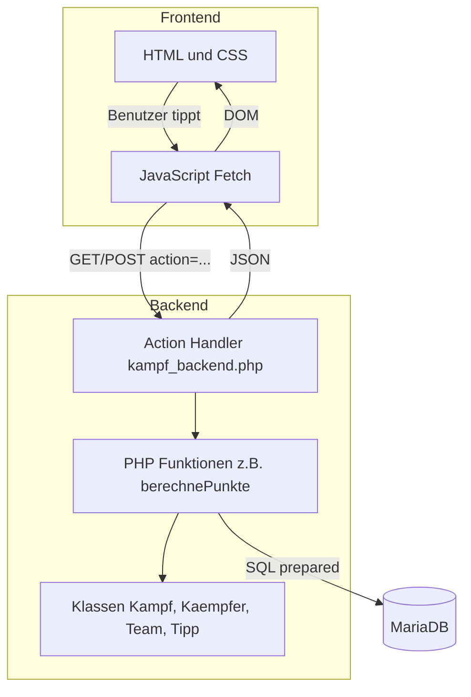

# 🥊 KFC Tippspiel – Kulow Fighters Championship


Tippspiel für den Kampfabend **KFC – Kulow Fighters Championship am 10.10.2026**: **Rote Funken** (rote Ecke) gegen **Lange Garde** (gelbe Ecke).
Aufbau und Programmierstil sind wie beim [Tippspiel Kulowcup](https://github.com/M-0-K/Tippspiel_Kulowcup), nur mit einer Timeline aus Kämpfen statt eines Turnierbaums.

## 📝 Inhaltsverzeichnis
- [So funktioniert's](#-so-funktionierts)
- [Projektstruktur](#-projektstruktur)
- [Architektur](#-architektur)
- [Start mit Docker](#-start-mit-docker)
- [Ablauf am Abend](#-ablauf-am-abend)
- [Kämpfer & Kämpfe pflegen](#-kämpfer--kämpfe-pflegen)
- [Bilder / Assets](#-bilder--assets)

## 🎯 So funktioniert's

1. **Registrieren** auf der Webseite (Benutzername + Passwort)
2. **Freischalten** am Ausschank (Barkeeper schaltet das Konto frei)
3. **Tippen** vor jedem Kampf: Sieger, Methode (K.O./T.K.O., Punkte, Aufgabe/DQ) und bei vorzeitigem Ende die Runde
4. **Champion werden**: die meisten Punkte am Ende des Abends gewinnen

| Treffer | Punkte |
|---|---|
| Richtiger Sieger | 3 |
| + richtige Methode | +1 |
| + richtige Runde (nur K.O./Aufgabe) | +2 |
| **Maximal pro Kampf** | **6** |
| Unentschieden richtig | 3 + 1 |

Ein Kampf ist **ab seinem Start gesperrt** (der Admin startet ihn). Auf spätere Kämpfe kann weiter getippt werden.
Zusätzlich zeigt die Seite den **Teamstand** (gewonnene Kämpfe Funken : Garde).

## 📁 Projektstruktur

Gleiches Muster wie im Kulowcup: Jede Seite hat einen eigenen Ordner mit
`seite.php` (Session-Check, Header/Menü/Footer einbinden), `seite_content.php` (HTML) und `seite.js` (lädt Daten per Fetch vom Backend).

```
├── compose.yml                 Docker: Web (PHP 8.2), MariaDB, phpMyAdmin, optional code-server & Cloudflare-Tunnel
├── .env.example                Passwörter & Domain (kopieren nach .env)
├── assets/                     Originalbilder (werden NICHT ausgeliefert)
├── css/index.css               globales Theme (Variablen oben in :root)
├── css/fightcard.css           Kampfkarten, Timeline, Teamstand, Liveansicht, Admin
├── data/                       weboptimierte Bilder, Logos, Schriften
├── DB/01_erstellungsscript_kfc.sql   Tabellen
├── DB/02_kampfnacht_2026.sql         Teams, Kämpfer, Kämpfe (hier Namen eintragen)
├── docs/db-modell.puml         Datenbankmodell (PlantUML)
├── docs/ASSETS.md              Liste aller Bilder + Prompts zum Erzeugen
├── script/db_connection.php    PDO-Verbindung (Docker-ENV)
├── script/kfc_helper.js        gemeinsame JS-Funktionen (postAction, zeigeMeldung, Kampfkarte)
├── script/icons.php            SVG-Icons
└── html/
    ├── kampf_backend.php       zentrale API (wie spiele_backend.php)
    ├── default/                header.php, menu.php, footer.php
    ├── startseite/  register/  login/  logout/
    ├── uservalidation/         Barkeeper: Konten freischalten (mit Suche)
    ├── tippen/                 Tipps abgeben
    ├── kampfabend/             Fight Card / Timeline (öffentlich)
    ├── liveview/               Beamer-Ansicht mit Runde & QR-Code (Strg+Shift+P = Präsentationsmodus)
    ├── ranking/                Punkte-Rangliste
    └── adminuebersicht/        Ringsteuerung: Start, Runde, Ergebnis, Zurücksetzen
```

## 🧠 Architektur



Datenmodell: siehe [`docs/db-modell.puml`](docs/db-modell.puml) (in VS Code mit der Extension *PlantUML* öffnen, `Alt+D`).

## 🚀 Start mit Docker

```bash
cp .env.example .env        # Passwörter anpassen!
docker compose up -d --build
```

| Dienst | Adresse |
|---|---|
| Webseite | http://localhost:50090 |
| phpMyAdmin | http://localhost:50091 |
| code-server (optional) | `docker compose --profile development up -d` → http://localhost:50092 |
| Cloudflare-Tunnel (optional) | `CF_TUNNEL_TOKEN` in `.env`, dann `docker compose --profile tunnel up -d` |

**Auf einem Linux-Server mit Cloudflare-Tunnel, VS Code im Browser und phpMyAdmin:**
→ Schritt-für-Schritt-Anleitung in **[`docs/DEPLOYMENT.md`](docs/DEPLOYMENT.md)** (nutzt `compose.server.yml`).

Die Datenbank wird beim **ersten Start** automatisch aus `DB/01_…` und `DB/02_…` angelegt.
Neu aufsetzen (⚠️ löscht alle User und Tipps): `docker compose down -v && docker compose up -d`.

**Logins** (Passwörter aus `.env`):
- `Admin` → Ringsteuerung + Freischalten
- `Barkeeper` → nur Freischalten

## 🔔 Ablauf am Abend

1. Vorher: Namen/Bilder in `DB/02_kampfnacht_2026.sql` eintragen, Passwörter in `.env` setzen, Server starten:
   `docker compose --profile tunnel up -d`
2. QR-Code: steht in der Liveansicht (Beamer). Die Seite ist unter der Domain aus `PUBLIC_URL` erreichbar.
3. Ausschank: als `Barkeeper` einloggen → Konten per Suche freischalten.
4. Ring: als `Admin` einloggen → **Kampf starten** (Tipps gesperrt) → **Runde +/−** → **Kampf beenden** (Sieger, Methode, Runde).
   Bei Fehlbedienung: **Zurücksetzen**.
5. Beamer: Liveansicht öffnen, `Strg + Shift + P` blendet das Menü aus.
6. Danach Backup ziehen und Server stoppen:

```bash
docker exec kfc_mariadb mariadb-dump -uroot -p"$MYSQL_ROOT_PASSWORD" tippspiel > DB/backup/KFC_2026.sql
docker compose down
```

## ✏️ Kämpfer & Kämpfe pflegen

Wie beim Kulowcup per SQL – entweder vor dem ersten Start in `DB/02_kampfnacht_2026.sql` oder danach in phpMyAdmin:

```sql
-- Kämpfer umbenennen + Bild setzen (Bild liegt in data/kaempfer/)
UPDATE kaempfer SET Name = 'Max Mustermann', Spitzname = 'Der Hammer', Bild = 'max.jpg' WHERE Kpid = 1;

-- Uhrzeit, Rundenzahl oder Bezeichnung eines Kampfes ändern
UPDATE kampf SET Uhrzeit = '2026-10-10 20:15:00', Runden = 3, Bezeichnung = 'Hauptkampf' WHERE Reihenfolge = 7;
```

Rote Ecke (`kampf.Rot`) = immer ein Kämpfer der Roten Funken, gelbe Ecke (`kampf.Gelb`) = immer Lange Garde.
Ein Kampf mit `Bezeichnung = 'Hauptkampf'` bekommt die besondere Gold-Karte und – falls vorhanden – das Face-off-Bild `data/kaempfer/faceoff_<Reihenfolge>.jpg`.

## 🎨 Bilder / Assets

Alle Bilder, die noch erstellt werden können (mit fertigen KI-Prompts), stehen in **[`docs/ASSETS.md`](docs/ASSETS.md)**.
Fehlt ein Bild, nutzt die Seite automatisch einen Platzhalter.

Schriften: [Oswald](https://fonts.google.com/specimen/Oswald) (SIL Open Font License, lokal in `data/fonts/`).
Icons: im Stil von [Lucide](https://lucide.dev) (ISC-Lizenz). QR-Code: [qrcodejs](https://github.com/davidshimjs/qrcodejs) (MIT).
