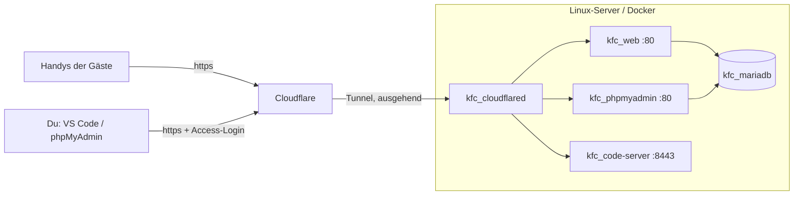

# 🚀 Deployment auf einem Linux-Server mit Docker & Cloudflare-Tunnel

Diese Anleitung bringt das KFC Tippspiel auf einen Linux-Server (z.B. Ubuntu/Debian, Raspberry Pi, Mini-PC, VPS).
Von außen ist alles **nur über den Cloudflare-Tunnel** erreichbar. Du brauchst also **keine Portfreigabe am Router** und keine eigene SSL-Einrichtung.

**Was am Ende läuft** (`compose.server.yml`):

| Dienst | Container | Öffentlich über Tunnel (Beispiel) | Lokal auf dem Server |
|---|---|---|---|
| Webseite (Apache + PHP 8.2) | `kfc_web` | `https://kulow-fighters.win` | `http://127.0.0.1:50090` |
| Datenbank (MariaDB 10.11) | `kfc_mariadb` | – (nie öffentlich) | – |
| phpMyAdmin | `kfc_phpmyadmin` | `https://pma.kulow-fighters.win` 🔒 | `http://127.0.0.1:50091` |
| VS Code im Browser (code-server) | `kfc_code-server` | `https://code.kulow-fighters.win` 🔒 | `http://127.0.0.1:50092` |
| Cloudflare-Tunnel | `kfc_cloudflared` | – | – |

🔒 = zusätzlich mit **Cloudflare Access** schützen (Schritt 5). Ohne diesen Schutz kann jeder die Login-Seite erreichen.



---

## Inhalt
1. [Voraussetzungen](#1-voraussetzungen)
2. [Docker installieren](#2-docker-installieren)
3. [Projekt auf den Server holen](#3-projekt-auf-den-server-holen)
4. [Cloudflare-Tunnel anlegen](#4-cloudflare-tunnel-anlegen)
5. [VS Code & phpMyAdmin absichern (Cloudflare Access)](#5-vs-code--phpmyadmin-absichern-cloudflare-access)
6. [.env ausfüllen](#6-env-ausfüllen)
7. [Starten & prüfen](#7-starten--prüfen)
8. [Kämpfer eintragen & Bilder hochladen](#8-kämpfer-eintragen--bilder-hochladen)
9. [Am Abend](#9-am-abend)
10. [Nach dem Abend: Backup & Abschalten](#10-nach-dem-abend-backup--abschalten)
11. [Updates einspielen](#11-updates-einspielen)
12. [Fehlersuche](#12-fehlersuche)
13. [Befehls-Spickzettel](#13-befehls-spickzettel)

---

## 1. Voraussetzungen

- Ein Linux-Rechner mit Internet (Ubuntu 22.04/24.04, Debian 12 oder Raspberry Pi OS 64-bit), mindestens 1 GB RAM.
- Ein **Cloudflare-Konto** (kostenlos) und die **Domain in Cloudflare**, z.B. `kulow-fighters.win`.
  - Domain neu kaufen: im Cloudflare-Dashboard unter **Domain Registration → Register Domains**.
  - Domain liegt woanders: in Cloudflare **Add a site** und die Nameserver beim bisherigen Anbieter auf die von Cloudflare umstellen.
    Das kann einige Stunden dauern, also **nicht erst am Abend selbst** machen.
- SSH-Zugang zum Server.

## 2. Docker installieren

```bash
# Docker (offizielles Installationsskript)
curl -fsSL https://get.docker.com | sudo sh

# eigenen Benutzer zur docker-Gruppe hinzufügen (danach einmal ab- und wieder anmelden)
sudo usermod -aG docker $USER

# prüfen
docker --version
docker compose version
```

## 3. Projekt auf den Server holen

**Variante A – über Git** (empfohlen, wenn das Repo z.B. auf GitHub liegt):

```bash
sudo mkdir -p /opt/kfc && sudo chown $USER:$USER /opt/kfc
git clone https://github.com/<DEIN-NAME>/Tippspiel_KFC.git /opt/kfc
cd /opt/kfc
```

**Variante B – ohne GitHub, direkt vom Windows-PC kopieren** (PowerShell auf dem PC):

```powershell
# einmalig: Ordner auf dem Server anlegen
ssh user@server "sudo mkdir -p /opt/kfc && sudo chown user:user /opt/kfc"
# Projekt kopieren (ohne .env und ohne Docker-Daten)
scp -r C:\git\github\Tippspiel_KFC\* C:\git\github\Tippspiel_KFC\.htaccess C:\git\github\Tippspiel_KFC\.env.example user@server:/opt/kfc/
```

Oder als Git-Bundle (behält die Historie):

```powershell
cd C:\git\github\Tippspiel_KFC
git bundle create kfc.bundle --all
scp kfc.bundle user@server:/opt/
ssh user@server "git clone /opt/kfc.bundle /opt/kfc"
```

## 4. Cloudflare-Tunnel anlegen

1. [one.dash.cloudflare.com](https://one.dash.cloudflare.com) öffnen (Cloudflare **Zero Trust**, beim ersten Mal einen Team-Namen vergeben, Free-Plan wählen).
2. **Networks → Tunnels → Create a tunnel** → Typ **Cloudflared** → Name z.B. `kfc`.
3. Bei "Install and run a connector" **Docker** wählen und aus dem angezeigten Befehl **nur den Token** kopieren
   (die lange Zeichenkette nach `--token`). Den Befehl selbst **nicht** ausführen, das übernimmt unser Compose.
4. **Public Hostnames** anlegen (Tab "Public Hostname" → "Add a public hostname"):

   | Subdomain | Domain | Service-Typ | URL |
   |---|---|---|---|
   | *(leer)* | `kulow-fighters.win` | HTTP | `web:80` |
   | `www` | `kulow-fighters.win` | HTTP | `web:80` |
   | `code` | `kulow-fighters.win` | HTTP | `code-server:8443` |
   | `pma` | `kulow-fighters.win` | HTTP | `phpmyadmin:80` |

   ⚠️ Als URL immer den **Container-Namen** eintragen (`web:80`), **nicht** `localhost`. Der Tunnel läuft selbst in einem Container im selben Docker-Netz.
5. Speichern. Der Tunnel steht auf "Inactive", bis der Container läuft (Schritt 7).

## 5. VS Code & phpMyAdmin absichern (Cloudflare Access)

code-server und phpMyAdmin haben zwar eigene Passwörter. Trotzdem sollten nur **du** (und ggf. Helfer) die Seiten überhaupt sehen.

1. Zero Trust → **Access → Applications → Add an application → Self-hosted**.
2. Name `KFC Admin-Tools`, Domains: `code.kulow-fighters.win` und `pma.kulow-fighters.win`.
3. **Policy** anlegen: Action *Allow*, Include → *Emails* → deine E-Mail-Adresse(n).
4. Login-Methode: "One-time PIN" (Code per E-Mail) reicht völlig.

Danach fragt Cloudflare vor VS Code und phpMyAdmin nach deiner E-Mail und schickt dir einen Code.
Die **Hauptseite** (`kulow-fighters.win`) bekommt **keine** Access-Regel, die Gäste sollen ja drauf.

## 6. .env ausfüllen

```bash
cd /opt/kfc
cp .env.example .env
nano .env
```

| Variable | Was eintragen |
|---|---|
| `ADMIN_PASSWORD` | Passwort für den Login `Admin` (Ringsteuerung) |
| `BARKEEPER_PASSWORD` | Passwort für den Login `Barkeeper` (Ausschank) – kurz und gut tippbar |
| `DB_PASSWORD`, `MYSQL_ROOT_PASSWORD` | lange Zufallspasswörter |
| `CODE_SERVER_PASSWORD` | Passwort für VS Code im Browser |
| `CF_TUNNEL_TOKEN` | Token aus Schritt 4 |
| `PUBLIC_URL` | `https://kulow-fighters.win` (steht im Footer und im QR-Code) |
| `PUID` / `PGID` | Ausgabe von `id -u` bzw. `id -g` (meist `1000`) |
| `PMA_URL` | `https://pma.kulow-fighters.win` |

Zufallspasswörter erzeugen:

```bash
openssl rand -base64 18
```

Die `.env` danach vor anderen Benutzern schützen:

```bash
chmod 600 .env
```

> ⚠️ Die Datenbank-Passwörter werden **beim allerersten Start** in die DB übernommen.
> Wer sie später ändert, muss die DB neu anlegen (`down -v`, siehe Abschnitt 13) oder das Passwort in MariaDB von Hand ändern.

## 7. Starten & prüfen

```bash
cd /opt/kfc
docker compose -f compose.server.yml up -d --build
docker compose -f compose.server.yml ps
```

Alle Container sollten `running` sein, `kfc_mariadb` zusätzlich `healthy`.

Prüfen:

```bash
# Webseite lokal auf dem Server
curl -I http://127.0.0.1:50090/html/startseite/startseite.php      # → HTTP/1.1 200 OK

# Datenbank angelegt?
docker logs kfc_mariadb 2>&1 | grep -E "01_|02_"                    # → running ... 01_erstellungsscript_kfc.sql / 02_...

# Tunnel verbunden?
docker logs kfc_cloudflared 2>&1 | grep -i "registered"             # → Registered tunnel connection ...
```

Dann im Browser bzw. am Handy öffnen: `https://kulow-fighters.win` ✅

**Kurzer Funktionstest** (5 Minuten, am besten am Handy):
1. Registrieren → als `Barkeeper` einloggen → Konto freischalten.
2. Mit dem Test-Konto einloggen → zwei Kämpfe tippen → speichern.
3. Als `Admin` Kampf 1 starten → Runde + → beenden → Ranking prüfen.
4. Danach alles zurücksetzen (Abschnitt 13: "Datenbank komplett neu").

## 8. Kämpfer eintragen & Bilder hochladen

**Mit VS Code im Browser** (`https://code.kulow-fighters.win`):
- Bilder per **Drag & Drop** in den Ordner `data/kaempfer/` ziehen (Dateinamen klein, ohne Umlaute/Leerzeichen, z.B. `max.jpg`).
- Welche Bilder es gibt und wie man sie erzeugt: [`docs/ASSETS.md`](ASSETS.md).

**Namen eintragen:**
- **Vor dem ersten Start:** in `DB/02_kampfnacht_2026.sql` (wird beim ersten Start automatisch eingespielt).
- **Nach dem Start:** in phpMyAdmin (`https://pma.kulow-fighters.win`, Login mit `DB_USER` / `DB_PASSWORD`) → Datenbank `tippspiel` → Reiter **SQL**:

```sql
UPDATE kaempfer SET Name = 'Max Mustermann', Spitzname = 'Der Hammer', Bild = 'max.jpg' WHERE Kpid = 1;
UPDATE kaempfer SET Name = 'Tom Beispiel',   Spitzname = 'Blitz',      Bild = 'tom.jpg' WHERE Kpid = 11;
UPDATE kampf SET Uhrzeit = '2026-10-10 19:30:00', Runden = 3 WHERE Reihenfolge = 1;
```

Kpid 1–7 = Rote Funken, Kpid 11–17 = Lange Garde (siehe `DB/02_kampfnacht_2026.sql`).

## 9. Am Abend

| Wer | Was | Wo |
|---|---|---|
| Gäste | QR-Code scannen → registrieren → tippen | Handy |
| Ausschank | Login `Barkeeper` → Name suchen → **Freischalten** | Handy/Tablet am Tresen |
| Vorab (PN) | Gäste schicken Moritz ihren Benutzernamen → als `Admin` oder `Barkeeper` → **Freischalten** (geht schon am Vorabend) | Handy |
| Ring | Login `Admin` → **Kampf starten** → **Runde +** → **Kampf beenden** (Sieger, Methode, Runde) | Handy am Ring |
| Beamer | `https://kulow-fighters.win/html/liveview/liveview.php` → `Strg + Shift + P` (Menü weg) | Laptop am Beamer |

- Ein Kampf ist ab **"Kampf starten"** für Tipps gesperrt.
- Falsch eingetragen? **"Zurücksetzen"** setzt den Kampf wieder auf "geplant".
- QR-Code zum Ausdrucken: Liveansicht am Laptop öffnen, QR-Code unten rechts abfotografieren oder screenshotten.

## 10. Nach dem Abend: Backup & Abschalten

```bash
cd /opt/kfc
# Backup der Datenbank (Tipps, User, Ergebnisse)
docker exec kfc_mariadb sh -c 'mariadb-dump -uroot -p"$MYSQL_ROOT_PASSWORD" tippspiel' > DB/backup/KFC_2026_$(date +%F).sql

# alles stoppen (Daten bleiben im Volume erhalten)
docker compose -f compose.server.yml down
```

Das Backup liegt in `DB/backup/`. Es wird nicht ins Git eingecheckt und auch nicht über die Webseite ausgeliefert.

Wiederherstellen:

```bash
docker exec -i kfc_mariadb sh -c 'mariadb -uroot -p"$MYSQL_ROOT_PASSWORD" tippspiel' < DB/backup/KFC_2026_2026-10-10.sql
```

## 11. Updates einspielen

```bash
cd /opt/kfc
git pull                                              # bzw. Dateien neu kopieren
docker compose -f compose.server.yml up -d --build    # baut neu, wenn sich docker/ geändert hat
```

PHP-, JS- und CSS-Änderungen sind sofort aktiv, weil der Projektordner in den Container eingebunden ist. Am Handy ggf. die Seite neu laden.
Änderungen in VS Code im Browser landen direkt auf dem Server. Danach dort im Terminal committen:
`git add -A && git commit -m "…"`.

## 12. Fehlersuche

| Problem | Ursache / Lösung |
|---|---|
| **502 Bad Gateway** von Cloudflare | Im Tunnel steht `localhost:50090` statt `web:80`. Public Hostname korrigieren (Schritt 4). Oder `kfc_web` läuft nicht: `docker compose -f compose.server.yml ps`. |
| **Error 1033** (Tunnel) | `kfc_cloudflared` läuft nicht oder der Token ist falsch: `docker logs kfc_cloudflared`. |
| Compose meckert "… in .env setzen" | Variable in `.env` fehlt oder ist leer. |
| "Server error" auf der Seite | DB nicht erreichbar oder falsches Passwort: `docker logs kfc_web`, `docker logs kfc_mariadb`. Nach einer Passwort-Änderung: DB neu anlegen. |
| Seite ohne Kämpfe | Die SQL-Skripte laufen nur beim **ersten** Start mit leerem Volume. Prüfen: `docker logs kfc_mariadb \| grep 02_`. Notfalls DB neu anlegen. |
| "Server configuration error" beim Login | `ADMIN_PASSWORD` / `BARKEEPER_PASSWORD` fehlen in `.env`. |
| VS Code kann Dateien nicht speichern | `PUID`/`PGID` passen nicht zum Besitzer von `/opt/kfc`: `id -u`, `ls -ln /opt/kfc`, ggf. `sudo chown -R $USER:$USER /opt/kfc`. |
| Neue Bilder werden nicht angezeigt | Dateiname in der DB (`kaempfer.Bild`) und in `data/kaempfer/` müssen exakt gleich sein (Groß-/Kleinschreibung!). |
| Alte Version am Handy | Cloudflare/Browser-Cache: Seite neu laden. Im Cloudflare-Dashboard ggf. **Caching → Purge Everything**. |

Logs live ansehen:

```bash
docker compose -f compose.server.yml logs -f --tail=50
```

## 13. Befehls-Spickzettel

```bash
cd /opt/kfc
alias kfc='docker compose -f compose.server.yml'   # optional, spart Tipparbeit

kfc up -d --build        # starten / aktualisieren
kfc ps                   # Status
kfc logs -f web          # Logs der Webseite
kfc restart web          # Webserver neu starten
kfc down                 # stoppen (Daten bleiben)

# ⚠️ Datenbank komplett neu (löscht ALLE User, Tipps, Ergebnisse!)
kfc down -v && kfc up -d

# MariaDB-Konsole
docker exec -it kfc_mariadb sh -c 'mariadb -uroot -p"$MYSQL_ROOT_PASSWORD" tippspiel'
```
